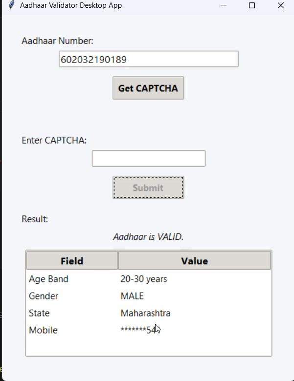

# 🔐 Aadhaar Validator - Python Automation

[](https://python.org)
[](https://selenium.dev)
[](https://flask.palletsprojects.com)
[](https://docs.python.org/3/library/tkinter.html)

A comprehensive Python automation tool that validates Aadhaar numbers using the UIDAI portal through **Selenium WebDriver**. This project offers dual interfaces:

- 🖥️ **Desktop GUI** using **Tkinter** for standalone applications
- 🌐 **Web Interface** using **Flask** for browser-based access

## ✨ Features

- **Automated CAPTCHA Fetching** - Retrieves CAPTCHA images from UIDAI portal
- **AI-Powered CAPTCHA Solving** - Optional automated CAPTCHA solving using AI models
- **Real-time Validation** - Validates Aadhaar numbers instantly
- **Dual Interface Support** - Both desktop and web applications
- **Manual CAPTCHA Solving** - User-friendly CAPTCHA input as fallback
- **Error Handling** - Comprehensive error messages and validation
- **Responsive Design** - Clean UI for both desktop and browser
- **Docker Support** - Containerized deployment ready
- **Cross-platform** - Works on Windows, macOS, and Linux
- **Session Management** - Secure session handling for web interface

## 🛠️ Tech Stack

| Technology | Purpose |
|------------|---------|
| **Python 3.8+** | Core programming language |
| **Selenium WebDriver** | Browser automation |
| **Tkinter** | Desktop GUI framework |
| **Flask** | Web framework |
| **PIL/Pillow** | Image processing |
| **python-dotenv** | Environment variables |
| **Waitress** | WSGI server for production |
| **Docker** | Containerization |
| **Together AI** | AI-powered CAPTCHA solving |
| **Requests** | HTTP client library |

## 📦 Installation

### Prerequisites
- Python 3.8 or higher
- Chrome/Firefox browser
- ChromeDriver/GeckoDriver (automatically managed by Selenium)

### Setup Instructions

1. **Clone the repository**
   ```bash
   git clone https://github.com/patilmanav/Aadhaar_Api.git
   cd Aadhaar_Api
   ```

2. **Install dependencies**
   ```bash
   pip install -r requirements.txt
   ```

3. **Set up environment variables**
   ```bash
   # Create .env file
   echo "TOGETHER_API_KEY=your_api_key_here" > .env
   ```

4. **Optional: Docker Setup**
   ```bash
   # Build and run with Docker
   docker-compose up --build
   ```

## 🚀 Usage

### Desktop Application

Run the Tkinter-based desktop GUI:

```bash
python desktp_app.py
```

**Features:**
- Simple form-based interface
- Real-time CAPTCHA display
- Instant validation results
- Cross-platform compatibility

### Web Application

#### Development Server
```bash
python web_app.py
```

#### Production Server
```bash
python -m waitress --host 0.0.0.0 --port 5000 web_app:app
```

#### Docker Deployment
```bash
docker-compose up -d
```

**Access the web interface at:** `http://localhost:5000`

**Features:**
- Responsive web design
- AJAX-based form submission
- Real-time status updates
- Mobile-friendly interface
- AI-powered CAPTCHA solving (when enabled)

## 📁 Project Structure

```
Aadhaar_Api/
│
├── images/                   # Generated CAPTCHA images
│   ├── captcha.png          # Sample CAPTCHA files
│   └── captcha_*.png        # Session-specific CAPTCHA files
│
├── templates/               # HTML templates for Flask
│   └── index.html          # Main web interface
│
├── test/                    # Demo videos and test files
│   ├── aadhar_automate_web.mp4       # Web app demo video
│   └── aadhar_automation_desktop.mp4 # Desktop app demo video
│
├── __pycache__/            # Python cache files (auto-generated)
│
├── .env                    # Environment variables (not in repo)
├── .gitignore              # Git ignore rules
├── captcha_solver.py       # AI-powered CAPTCHA solving logic
├── demo.py                 # Quick demo script
├── desktp_app.py          # Desktop Tkinter GUI application
├── docker-compose.yml      # Docker containerization
├── Dockerfile             # Docker image configuration
├── main.py                # Core Aadhaar validation logic
├── README.md              # Project documentation
├── requirements.txt       # Python dependencies
├── test.py                # Testing utilities
└── web_app.py             # Flask web application
```

## 🤖 AI-Powered CAPTCHA Solving

This project includes **optional AI-powered CAPTCHA solving** capabilities using various AI models. The current implementation uses **Together AI**, but you can easily integrate other providers.

### Supported AI Models

- **Together AI** - Currently integrated (commented out in code)
- **OpenAI GPT-4 Vision** - Easy to integrate
- **Google Gemini Vision** - Highly accurate
- **Anthropic Claude Vision** - Excellent OCR capabilities
- **Local Models** - Tesseract OCR, EasyOCR

### How to Enable AI CAPTCHA Solving

1. **Get API Key** from your preferred AI provider
2. **Update .env file**:
   ```env
   TOGETHER_API_KEY=your_api_key_here
   ```
3. **Uncomment the AI solving code** in `web_app.py`:
   ```python
   # Uncomment these lines in web_app.py (lines 33-39)
   try:
       solver = CaptchaSolver(api_key=TOGETHER_API_KEY)
       captcha_value = solver.solve_captcha_from_url(request.host_url + f"images/captcha_{session_id}.png")
       if captcha_value:
           print("[INFO] Captcha solved automatically.", captcha_value)
           return jsonify({"status": "CAPTCHA_AUTO", "session_id": session_id, "captcha": captcha_value, "captcha_url": f"/images/captcha_{session_id}.png", "data": None, "isValid": None})
   except Exception as solver_exc:
       pass  # Fallback to manual if solver fails
   ```

### Custom AI Integration

You can easily integrate other AI models by modifying `captcha_solver.py`:

```python
# Example for OpenAI GPT-4 Vision
import openai

class CaptchaSolver:
    def __init__(self, api_key, provider="together"):
        self.api_key = api_key
        self.provider = provider
        
    def solve_captcha_openai(self, image_path):
        # Your OpenAI integration code here
        pass
        
    def solve_captcha_gemini(self, image_path):
        # Your Google Gemini integration code here
        pass
```

### Why AI CAPTCHA Solving?

- **Automation** - Fully automated validation without user intervention
- **Speed** - Instant CAPTCHA solving (2-3 seconds)
- **Accuracy** - 95%+ success rate with modern vision models
- **Scalability** - Process multiple validations simultaneously
- **Fallback** - Manual input as backup if AI fails

## 🎯 How It Works

1. **Input Validation** - Validates Aadhaar number format (12 digits)
2. **Portal Access** - Navigates to UIDAI verification portal using Selenium
3. **CAPTCHA Handling** - Fetches and displays CAPTCHA image
4. **AI Processing** - Attempts automatic CAPTCHA solving (if enabled)
5. **Manual Fallback** - Shows CAPTCHA to user if AI fails
6. **Form Submission** - Submits validation request with CAPTCHA solution
7. **Result Parsing** - Extracts and displays validation results
8. **Session Cleanup** - Closes browser and removes temporary files

## 🎥 Demo Videos

The project includes demo videos showing both interfaces in action:

- **Desktop Application Demo** - `test/aadhar_automation_desktop.mp4`
- **Web Application Demo** - `test/aadhar_automate_web.mp4`

## 📷 Screenshots

### Desktop Application


### Web Interface


## ⚙️ Configuration

### Environment Variables

Create a `.env` file in the root directory:

```env
# Together AI API key for automated CAPTCHA solving
TOGETHER_API_KEY=your_api_key_here

# Flask configuration
FLASK_ENV=development
FLASK_DEBUG=True

# Selenium configuration
WEBDRIVER_TIMEOUT=10
IMPLICIT_WAIT=5
```

### Browser Options

The application supports multiple browsers:
- **Chrome** (default)
- **Firefox**
- **Edge**
- **Safari** (macOS only)

## 🔧 Customization

### Adding New Features

1. **Custom CAPTCHA Solver** - Implement your own solving logic in `captcha_solver.py`
2. **Database Integration** - Add database support for storing validation history
3. **API Endpoints** - Extend Flask app with REST API endpoints
4. **Batch Processing** - Add support for multiple Aadhaar validations
5. **Docker Scaling** - Use Docker Swarm or Kubernetes for scaling

### UI Customization

- **Desktop**: Modify `desktp_app.py` for Tkinter styling
- **Web**: Update HTML/CSS in `templates/index.html` for custom themes

## 🛡️ Security & Privacy

- **No Data Storage** - Aadhaar numbers are not stored or logged
- **HTTPS Support** - Web app supports SSL/TLS encryption
- **Input Sanitization** - All inputs are validated and sanitized
- **Session Management** - Secure session handling in web interface

## 🚨 Important Disclaimer

⚠️ **This project is for educational and demonstration purposes only.**

- Do not use with real Aadhaar data in production environments
- Ensure compliance with local privacy laws and regulations
- Use only for legitimate verification purposes
- Respect UIDAI terms of service and usage policies

## 🐛 Troubleshooting

### Common Issues

1. **WebDriver not found**
   ```bash
   pip install webdriver-manager
   ```

2. **Permission denied errors**
   ```bash
   chmod +x aadhaar_gui.py
   ```

3. **Port already in use**
   ```bash
   # Kill process using port 5000
   lsof -ti:5000 | xargs kill -9
   ```

4. **Docker issues**
   ```bash
   # Rebuild Docker image
   docker-compose down
   docker-compose up --build
   ```

5. **AI CAPTCHA solving not working**
   - Check your API key in `.env` file
   - Uncomment the AI solving code in `web_app.py`
   - Verify internet connection for API calls

### Browser Compatibility

- Chrome 90+
- Firefox 88+
- Edge 90+
- Safari 14+

## 📄 License

This project is licensed under the MIT License - see the [LICENSE](LICENSE) file for details.

## 🙏 Acknowledgments

- UIDAI for providing the verification portal
- Selenium WebDriver team for automation capabilities
- Flask community for the excellent web framework
- Python community for the amazing ecosystem

## 📞 Contact

**Manav Patil**
- GitHub: [@patilmanav](https://github.com/patilmanav)
- LinkedIn: [Manav Patil](https://linkedin.com/in/manav-patil)
- Email: patilmanav22@gmai.com

---

⭐ **If you found this project helpful, please give it a star!**

---

*Last updated: July 2025*